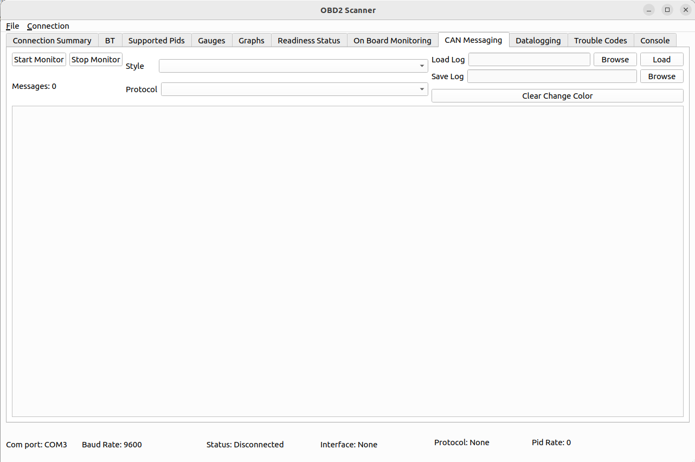
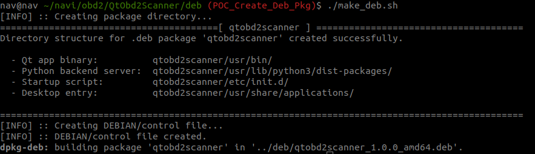

# QtObd2Scanner
An OBD 2 scanner app for cars written in Qt, C++ and Python

## OBD2 App

## Supported PIDs

## CAN Messaging

## DTC - Trouble Codes

## Data Logging

## Console Logging/Troubleshooting

## Generating Linux .deb installer

Run script scripts/make_deb.sh

